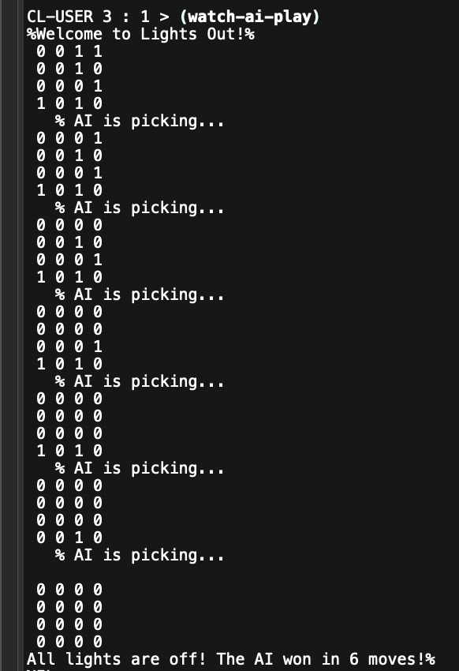

# P3 Lisp Lights-Out Game
## Khalid Kofiro

This is a Lisp code for a simple game that involves a 3x3 grid of lights. The game starts with a random number of lights turned on, and the objective is to turn them all off by flipping the light switches.

  

## Functions:

* print-board: Takes a list of 9 integers and prints them in a 3x3 grid format, with each row on a new line.

* flip-switch: Takes a board and a light argument, and flips the light at the specified position on the board. The function is implemented using recursion and conses a new list with the flipped light.

* lights-off: Takes a board argument and checks if all the lights on the board are off. It uses recursion and the and operator to check if the current light is off and the rest of the board is also off.

* play-game: This is the main function of the game that runs the game loop until all lights are off. It starts by printing a welcome message and initializing the game board with random values (0s and 1s). Then it continuously prompts the user for inputs until all lights are off or the user chooses to exit the game. It prints the current state of the board and prompts the user to enter a switch to flip. If the input is a valid switch (between 1 and 9), the switch is flipped and the move count is increased. If the input is 0, the game ends. If the input is invalid, the user is prompted to try again. Once all lights are off, the final state of the board is printed along with the message indicating the number of moves it took to win the game.

* watch-ai-play: Lets the user watch the AI play Lights Out. It generates a random board and uses the ai-move function to make moves until all lights are turned off. The AI has a 1-second pause between moves to make it easier for the user to view its game play. It then prints out the final state of the board and the number of moves it took for the AI to win.

* ai-move: Returns the index of a switch for the AI to flip based on the current state of the board. It does this by using a loop to find the first light (1) that is currently on, then picks it by returning the index of the light it found.
## Tests:

* test-flip-switch: Tests the flip-switch function by checking if the light at the specified position is flipped as expected.

* test-lights-off: Tests the lights-off function by checking if the function returns true when all the lights are off and false otherwise.

* test-ai-move: Tests the ai-move function by checking if the move returned is valid (between 1 and 9).

* test-input: Tests whether the user input matches an expected value. The expected value can be adjusted.

* lights-out-test: Runs all tests and prints the final result.

## Running the code:

To run the code, in your Lisp IDE load the file and it should evaluate whichever mode you uncommented: single player (play-game), or spectating the AI (watch-ai-play).

## How to play 

* Once the program is running, the player will be prompted to enter a switch number to flip (1 to 8, or 0 to exit). 

* The goal of the game is to turn off all the lights on the board. 

* After each move, the updated state of the board will be displayed, along with a message prompting the player to enter another switch number. 

* The game continues until all lights are turned off, at which point the final number of moves taken by the player will be displayed. 

* To exit the program at any time, the player can enter 0.

## AI Player

* The AI player is implemented using the ai-move function, the function uses a loop to find the first light that is currently on and returns its index plus 1, since the game is 1-indexed.

* You can enable this feature by uncommenting watch-ai-play and loading the file. Make sure that (play-game) is commented out.

Hope you enjoyed the game!